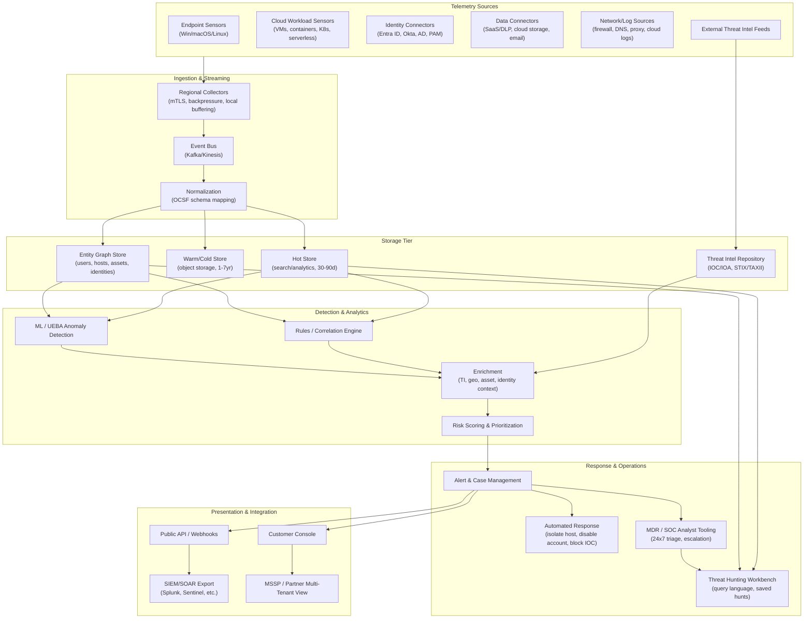
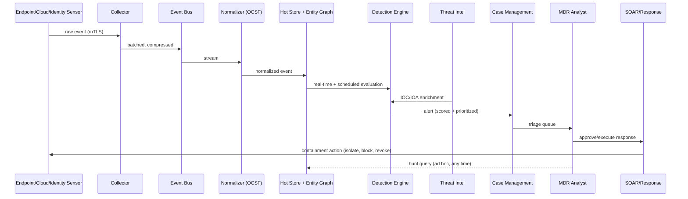

# Cybersecurity Platform — Technical Architecture

> Status: Draft v0.1 · Owner: TBD · Last updated: 2026-09-01
>
> This document defines the technical architecture for a cloud-delivered
> cybersecurity platform combining Endpoint Protection (EDR/EPP), Cloud
> Workload Protection (CWPP/CSPM), Identity Threat Detection & Response
> (ITDR), Data Protection (DSPM/DLP), a Threat Intelligence Platform (TIP),
> and Managed Detection & Response (MDR) with human-led threat hunting —
> the same category CrowdStrike Falcon, SentinelOne Singularity, and
> Palo Alto Cortex XDR compete in. It is referred to below as **"the
> Platform"**; naming/branding is a separate, unresolved decision and is
> intentionally not tied to the unrelated field-service app that also
> lives in this repository's history.

## 1. Guiding Principles

1. **Cloud-delivered, single data lake.** Every signal — endpoint, cloud,
   identity, data, network — lands in one normalized telemetry lake. No
   pillar gets its own silo; correlation across pillars is the product's
   core value, not an add-on.
2. **Lightweight collection, heavy lifting in the cloud.** Sensors/agents
   do capture and light filtering only. Detection logic, ML, and
   correlation run server-side so it can be updated continuously without
   touching millions of endpoints.
3. **API-first.** The console is a consumer of the same APIs a customer
   or MSSP partner would use. Nothing is console-exclusive.
4. **Secure-by-design, for a security company.** This product will be a
   high-value target. Its own SDLC, supply chain, and infrastructure must
   meet or exceed what it sells to customers (see §9).
5. **Open telemetry standards.** Normalize on OCSF (Open Cybersecurity
   Schema Framework) for events and STIX/TAXII for threat intel, so
   customers can bring existing SIEM/SOAR tooling instead of being locked
   in, and so the platform can ingest third-party sources.
6. **Multi-tenant from day one**, with per-tenant encryption keys and
   strict data isolation, because the MDR/threat-hunting service and
   channel/MSSP resale motion both require tenant-safe multi-tenancy.

## 2. High-Level Architecture

## 3. Product Pillars → Components

### 3.1 Endpoint Protection (EPP/EDR)
- Native agents for Windows, macOS, Linux; kernel/eBPF-level visibility
  (process, file, registry, network, memory).
- Local prevention (signature + behavioral) so protection survives loss
  of connectivity; cloud sync when online.
- Fleet management: policy groups, staged rollout, self-update, tamper
  protection (agent cannot be killed by a local admin without platform
  auth).

### 3.2 Cloud Workload Protection (CWPP/CSPM/CNAPP)
- Agent-based runtime protection for VMs, containers, and Kubernetes
  nodes (sidecar/daemonset model).
- Agentless posture scanning via cloud-provider APIs (AWS/Azure/GCP) for
  misconfiguration, excess IAM permissions, exposed storage, drift from
  benchmarks (CIS, NIST).
- Image/registry scanning in CI/CD (shift-left) plus admission control in
  K8s.
- Serverless/function instrumentation for ephemeral workloads.

### 3.3 Identity Threat Detection & Response (ITDR)
- Read-only connectors to Entra ID / Okta / on-prem AD / PAM tools.
- Detects credential misuse, impossible travel, privilege escalation,
  golden-ticket/kerberoasting patterns, dormant-account abuse, MFA
  fatigue attacks.
- Cross-links identity events to endpoint/cloud events via the Entity
  Graph so "this identity logged in from this endpoint then touched this
  cloud resource" is one correlated story, not three alerts.

### 3.4 Data Protection (DSPM/DLP)
- Discovery/classification connectors for cloud storage, SaaS apps
  (email, Drive/SharePoint, chat), and databases.
- Policy engine for exfiltration detection (unusual volume, destination,
  or sensitivity-label mismatch) — this is largely a detection problem
  layered on the identity + endpoint telemetry, not a separate stack.

### 3.5 Threat Intelligence Platform (TIP)
- Ingests commercial/open feeds (STIX/TAXII), platform's own crowdsourced
  telemetry (opt-in), and MDR analyst findings.
- Produces IOC/IOA, actor/campaign tracking, and automatic enrichment
  fed into the detection pipeline in near-real-time.
- Customer-facing: intel reports, adversary tracking, IOC lookup API.

### 3.6 Managed Detection & Response (MDR) + Threat Hunting
- This is a **service built on the same platform data**, not a separate
  product: 24x7 SOC analysts triage the Case Management queue with the
  same Hunting Workbench customers can optionally get self-service access
  to.
- Proactive hunting: hypothesis-driven queries across the hot store,
  scheduled/continuous hunts, and "campaign" tracking tied to the TIP.
- Response authority tiers per customer contract (notify-only, ask-first,
  or auto-contain) enforced by the SOAR layer's policy engine.

## 4. Shared Platform Services

These are built once and used by every pillar above — this is what
prevents the product from becoming six disconnected tools:

| Service | Purpose |
|---|---|
| Telemetry Ingestion Pipeline | Collector fleet, streaming bus, OCSF normalization |
| Entity Graph | Canonical identity for every user/host/workload/asset, used for correlation and blast-radius queries |
| Detection Engine | Rules (Sigma-compatible), correlation, and ML/UEBA models, pillar-agnostic |
| Threat Intel Repository | Central IOC/IOA store feeding enrichment across all pillars |
| Case & Alert Management | Single queue regardless of which pillar generated the alert |
| Response/SOAR Engine | Action library (isolate host, disable identity, block IOC, revoke session) with per-tenant authorization policy |
| Identity & Access (platform-internal) | Customer/tenant auth, RBAC, MSSP delegated-access model |
| Public API & Integration Layer | REST/GraphQL + webhooks + SIEM connectors, used by console and partners alike |

## 5. Data Flow (Detection Path)

## 6. Technology Stack (Recommendation)

| Layer | Recommendation | Why |
|---|---|---|
| Endpoint agent | Rust or Go, OS-native kernel/eBPF hooks | Memory-safety and small footprint matter when you're running on every customer endpoint |
| Cloud workload sensor | Go, DaemonSet/sidecar for K8s | Ecosystem fit with cloud-native tooling |
| Event transport | gRPC (agent→collector), Kafka or Kinesis (internal bus) | Proven at telemetry scale |
| Normalization schema | OCSF | Industry-standard, avoids reinventing a schema, eases customer SIEM integration |
| Hot store | ClickHouse or Elasticsearch/OpenSearch | Sub-second search over recent high-volume telemetry |
| Cold/warm store | Object storage (S3-compatible) + Parquet/Iceberg | Cheap long-term retention, queryable via Athena/Trino |
| Entity graph | Graph DB (Neo4j, or a property-graph layer over the hot store) | Correlation queries are inherently graph-shaped |
| Detection engine | Sigma-compatible rules engine + streaming ML (Flink/Spark Structured Streaming) | Portability of rules, real-time scoring |
| Threat intel | STIX/TAXII-compliant TIP (build thin layer, don't reinvent MISP) | Standards compatibility |
| Backend services | Kubernetes, Go/Python microservices | Standard for a multi-tenant SaaS control plane |
| API layer | REST + GraphQL, webhook delivery with retries | Predictable partner/SIEM integration |
| Console | React/TypeScript SPA | Standard, large talent pool |
| Secrets/keys | Per-tenant envelope encryption via HSM/KMS | Required for the isolation guarantee in §9 |

This is a starting recommendation, not a locked decision — should be
revisited once team skills and cloud provider (AWS/Azure/GCP) are fixed.

## 7. Multi-Tenancy & Scalability

- **Isolation model:** logical multi-tenancy in shared infrastructure by
  default (cost-efficient at SMB/mid-market scale), with a dedicated
  single-tenant deployment tier for large enterprise/regulated customers
  who require it.
- **Per-tenant encryption keys**, tenant ID on every row/partition, and
  query-layer enforcement (not just app-layer) so a bug in one service
  can't leak cross-tenant data.
- **MSSP/partner model:** a partner identity gets scoped, delegated
  access across a defined set of tenant IDs — this is the same
  mechanism the internal MDR SOC uses, just permissioned differently.
- **Scale target for design purposes:** design ingestion and hot storage
  to handle bursty telemetry (an incident can 10-100x a single tenant's
  normal event volume in minutes) without one tenant's incident degrading
  others — tenant-level rate limiting/backpressure at the collector.

## 8. Compliance & Trust Roadmap

Necessary for enterprise/mid-market sales motion, roughly in the order
customers will ask:

1. SOC 2 Type II
2. ISO 27001
3. GDPR / data residency controls (EU tenant data pinned to EU region)
4. HIPAA-readiness (if healthcare vertical is pursued)
5. FedRAMP (only if/when US public sector is pursued — long lead time,
   defer until product-market fit is proven elsewhere)

## 9. Securing the Platform Itself

A cybersecurity vendor is a higher-value breach target than most of its
customers (see: 3CX, SolarWinds, LastPass). Non-negotiables:

- Signed agent builds, reproducible builds where feasible, and a
  documented software supply chain (SBOM) for every release.
- Staged/canary rollout for detection content and agent updates — a bad
  update (see: CrowdStrike, July 2024) should never be pushed to 100% of
  fleet at once.
- Internal least-privilege: engineers do not have standing access to
  production customer telemetry; break-glass access is logged and
  time-boxed.
- The MDR SOC's own tooling is itself monitored by the platform
  ("dogfooding" is both a QA mechanism and a security control).

## 10. Suggested MVP Phasing

Building all six pillars simultaneously is not realistic for a first
release. Recommended sequencing:

- **Phase 1 (MVP):** Endpoint Protection (EDR/EPP) + shared platform
  services (§4) + basic MDR triage on top. This is the smallest slice
  that's independently sellable and validates the ingestion/detection
  core everything else reuses.
- **Phase 2:** Identity Threat Detection & Response — highest
  correlation value with endpoint data, and identity-based attacks are
  currently the dominant initial-access vector industry-wide.
- **Phase 3:** Cloud Workload Protection (CWPP/CSPM) — required once
  targeting customers with meaningful cloud footprint.
- **Phase 4:** Data Protection (DSPM/DLP) and the full Threat
  Intelligence Platform surface — highest build cost relative to
  differentiation, best tackled once the core correlation engine and
  customer base already exist.
- **MDR/threat hunting as a service** is layered on starting in Phase 1
  (even a small one) — it's how the team learns what detections actually
  matter before over-building self-service features nobody uses.

## 11. Competitive Landscape (Brief)

| Player | Strength | Gap to exploit |
|---|---|---|
| CrowdStrike Falcon | Best-in-class EDR, huge telemetry graph | Expensive, complex pricing, July 2024 update incident dented trust |
| SentinelOne | Strong autonomous/AI response | Smaller threat-intel/MDR bench than CrowdStrike |
| Microsoft Defender/Sentinel | Deep O365/Azure integration, bundled pricing | Weaker on non-Microsoft/multi-cloud, alert fatigue |
| Palo Alto Cortex XDR | Broad platform (network+cloud+endpoint) | Heavyweight, best for existing Palo Alto shops |
| Rapid7/Arctic Wolf | MDR-first, service-heavy | Less product depth, more human-cost-per-customer |

A credible wedge for a new entrant is usually **not** "do everything
better" — it's picking one pillar + a genuinely good MDR service and
winning the mid-market segment the big players price/deprioritize.

## 12. Open Decisions Needed

These materially change the architecture and should be resolved next:

1. **Primary target segment:** SMB self-serve, mid-market, or
   enterprise/regulated? Drives the multi-tenancy and compliance
   priority order in §7–8.
2. **Cloud provider** for the control plane (affects §6 concretely).
3. **Build vs. buy** for the Threat Intel feed itself (license
   commercial feeds vs. build from scratch) and for the SIEM/SOAR layer
   (build vs. deep-integrate with existing tools like Splunk/Sentinel).
4. **MDR staffing model:** in-house 24x7 SOC from day one, or
   phased/outsourced SOC-as-a-service until volume justifies in-house?
5. **Confirmed MVP pillar** — this doc recommends Endpoint (§10), but
   that should be validated against whatever go-to-market thesis or
   founding team expertise exists.
